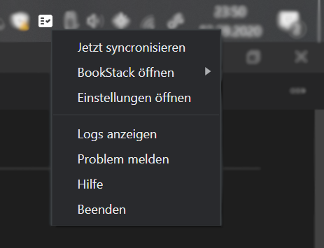

# Offline-Synchronisierung für BookStack

[Hier](https://www.bookstackapp.com/) geht es zur offizielen Seite von BookStack.

## Ziel
Mit BookStack-Sync ist es möglich, auch ohne Internetverbindung weiter mit BookStack zu arbeiten.  
Einmal gestartet, läuft BookStack-Sync im Hintergrund und synchronisiert nach einem Intervall, der in den Einstellungen frei definiert werden kann.
Eine Synchronisation kann auch manuell mit einem Rechtsklick gestartet werden.  

# Installieren

Damit BookStack-Sync funktioniert, müssen zunächst weitere Programme installiert werden.

## Folgende Programme müssen manuell installiert werden

### Docker  
Die Offline-Version von BookStack und die Datenbank werden später in einem Docker-Container laufen.   
Das offizielle Anleitung zur Installation von Docker ist [hier](https://docs.docker.com/engine/install/) verfügbar.

### mysql / mysqldump  
#### Ubuntu
`sudo apt install mariadb-client-10.3`

#### Windows
MariaDB von  [https://mariadb.org/download/](https://dev.mysql.com/downloads/file/?id=496597) herunterladen und installieren.

## Docker Container starten
`docker-compose.yml` herunterladen und `docker-compose up -d` im Terminal ausführen.

## BookStack-Sync installieren und einrichten
BookStack-Sync selbst ist mit dem Setup auf der [Release-Seite](https://github.com/otsmr/bookstack-sync/releases) schnell installiert.  

Nach der Installation die Einstellungen öffnen und die Zugangsdaten für die Datenbank und den FTP-Server der Online-Version von BookStack eingeben.

# Copyright und Lizenz

**BookStack-Sync** is MIT licensed.